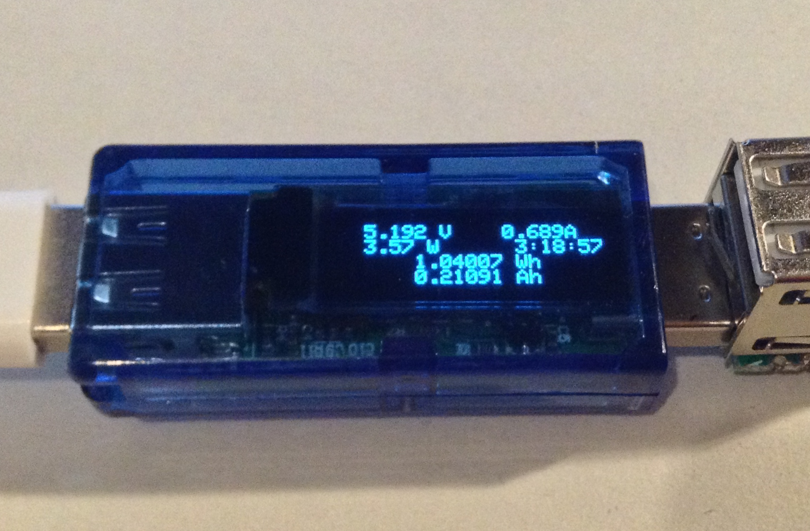

# Hacking OLED USB voltage meter ang fuel gauge

Hacked into a China made $5 USB OLED USB fuel gauge

## Requirements

* SDCC 3.4 and 3.5.0 tested, other versions should work. STM8 support is somehow buggy.
* ST-Link v1 or v2. v2 is tested, works well in Linux, slightly buggy in OS X.
* [https://github.com/vdudouyt/stm8flash](STM8Flash) 
* GNU make 3.81 and 4.0 tested, BSD might work

Building and flashing tested in Linux and OS X.

When using ST-LINK with the device plugged in, do not connect 5V power.

## The Circuit

Schematics TBD

### key components:

* STM8003F3P6 MCU, TSSOP20
* 0.91" OLED, 15-pin FPC, 128x32, controller SSD1306
* 25mOhm current sensing resistor
* 220uF/4V Tantalum capacitor at 3V3 rail
* LM358 as current sensing amplifier
* some SOT23-3 3.3V LDO, like XC6206P331MR(Marking 662*) or MCP1754ST-3302E/CB(Marking JDNN)
* 1N4148 Diode at VUSB rail

### MCU Pinout

|pin#| func | GPIO|net or signal path |
|---|---|----|---|
| 1 | | | |
| 2 | likely some control, discharge/load? | PD5/UART TX |R7-Q3-R9-D6, not mounted|
| 3 | ? |PD6/UART RX| C3, pin8 |
| 4 | reset || reset |
| ... |||
| 10| LED? |PA3| R8-D5 (NP)|
| 12| Current sensing bias|PC3| R3 |
| 14| OLED reset? || OLED:9|
| 15| OLED | CLK? | OLED:10|
| 16| OLED | MOSI? | OLED:11 |
| 17| OLED DC?| MISO?/PC7| OLED:12|
| 18| SWIM, and buttton |SWIM/PD1| button/SWIM|
| 19| voltage sensing |AIN3/PD2| |
| 20| current sensing |AIN4/PD3| LM358:7 |

Notes:

* Pin2 and 3 are interesting, look like some light communication design.
* Voltage divisor: 330k, 100k, Max V 3.3*4.3=14.19V
* current sensing, approx. 490mA->299.3mV, Max I ~5A 

### OLED module pinout

|Pin|ext component|function|
|---|---|---|
|15 |C| |
|14 |C| |
|13 ||IREF|
|12|MCU:17|MOSI|
|11|MCU:16|SCK|
|10|MCU:15| |
|9|MCU:14| |
|8 |GND| CS?|
|7,5| 3V| |
|6|GND| |
|4,3| Charge Pump| |
|2,1| Charge Pump| |

Notes:

* SPI is not connected ***correctly***, so can only be emulated by using GPIO
* CS is not connected, tied to low.
* On chip charge pump is used
